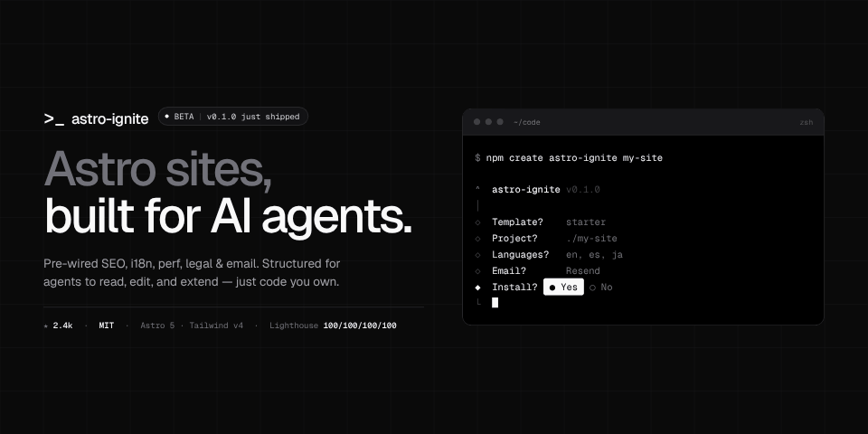
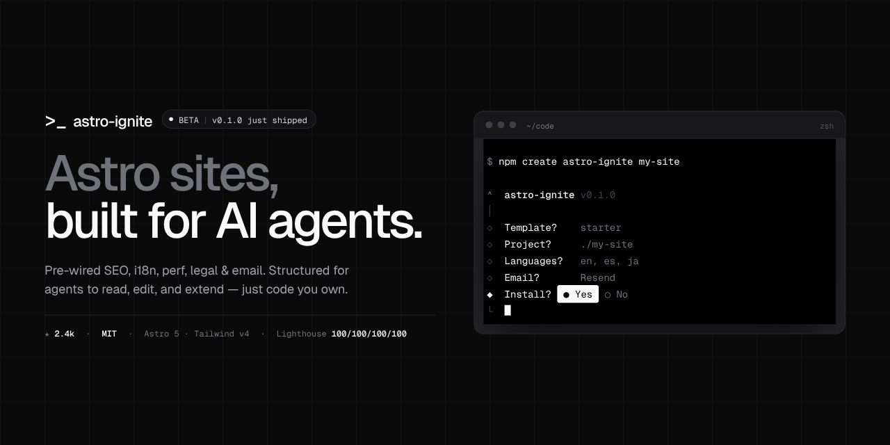
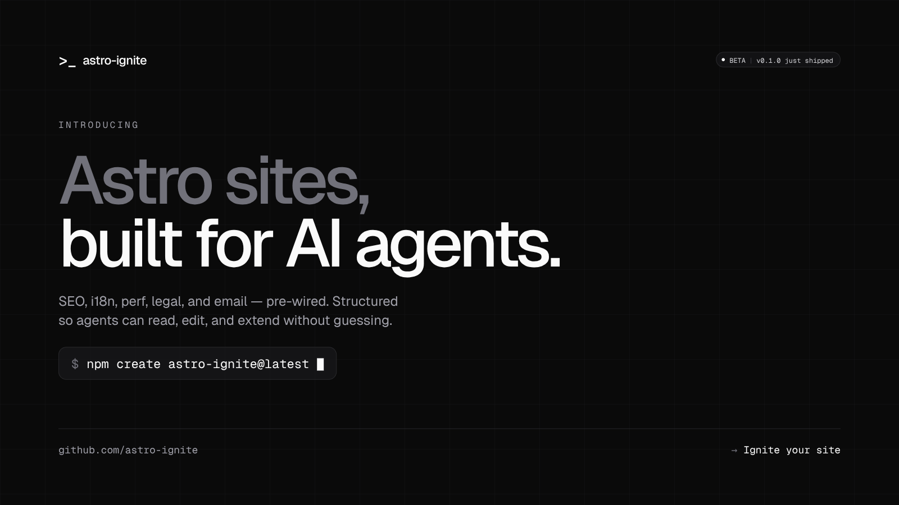
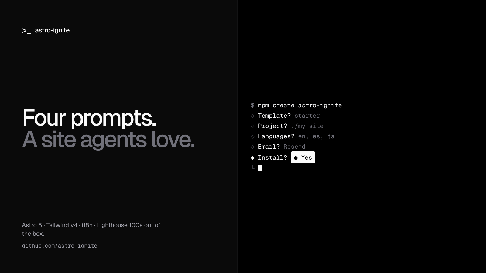
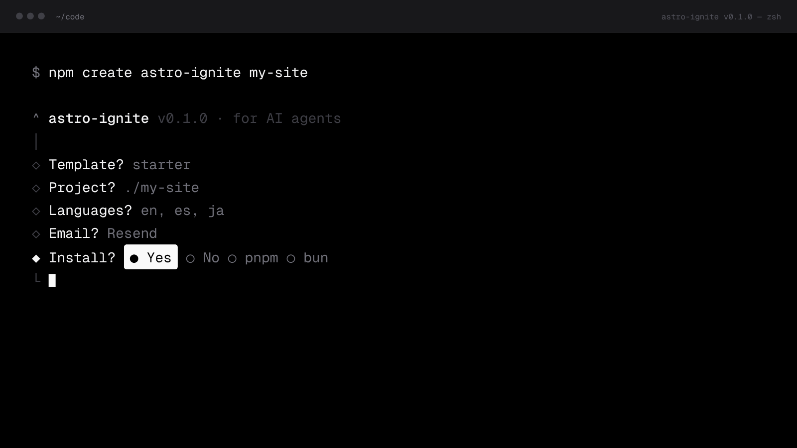
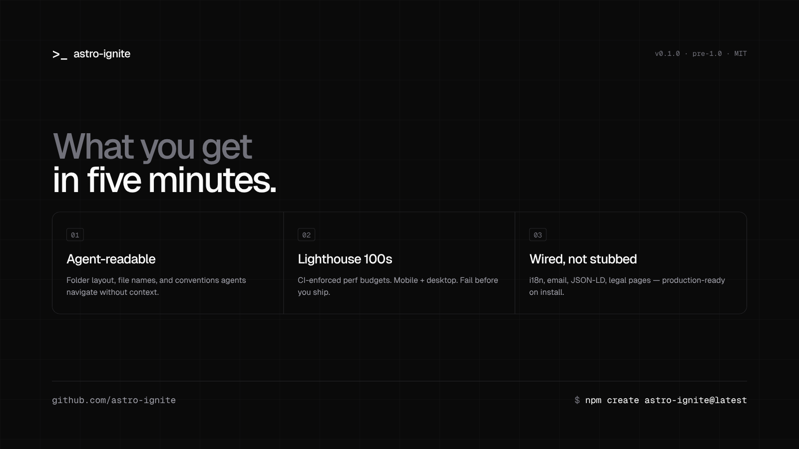
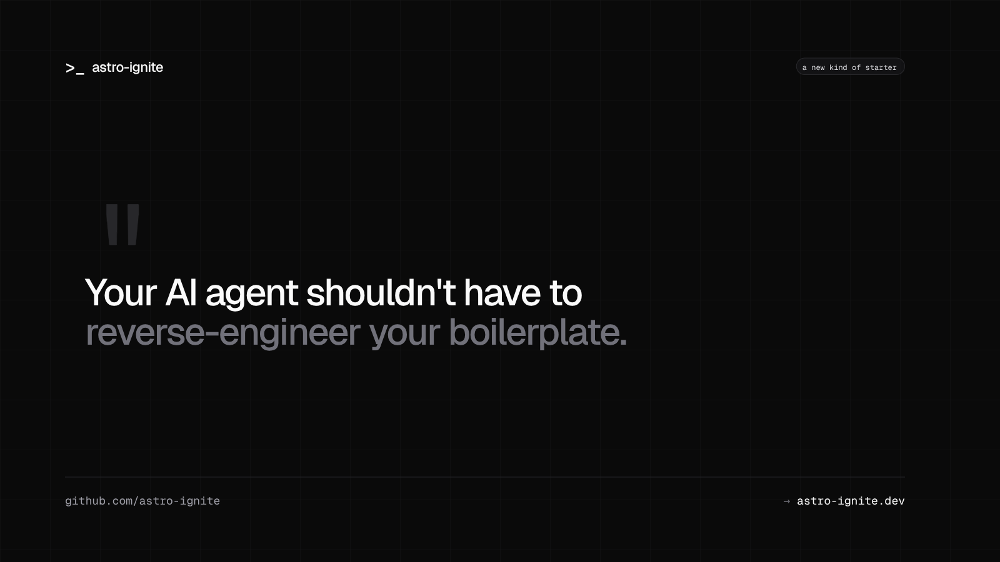
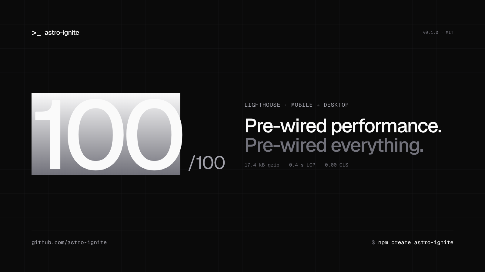

# astro-ignite



> shadcn-style CLI for bootstrapping production-grade Astro sites with top-tier SEO and performance defaults.

```bash
npm create astro-ignite@latest my-site
```

You answer five prompts. You get a finished site with SEO, i18n, perf, legal, and email pre-wired. You own every line of code — no runtime dependency on this tool.

## What you get

- **Lighthouse 100s on mobile** out of the box (CI-enforced)
- **Astro 5** with native i18n, content collections, and Astro Actions
- **Tailwind v4** with a layered CSS strategy (scoped above-the-fold + Tailwind below + critical-CSS extraction)
- **TypeScript-typed Schema.org JSON-LD** built from `schema-dts`
- **Image components** with AVIF + WebP, responsive `srcset`, LQIP placeholders
- **Geist Sans + Geist Mono** via `astro:fonts` (self-hosted, zero CLS)
- **Tri-state dark mode** (light / dark / system) with anti-flash inline script
- **Working contact form** with Astro Actions, Zod validation, and your choice of Resend or SMTP
- **Cookie banner + legal page templates** (privacy, terms, cookies) with i18n
- **Plausible analytics** (env-gated, consent-gated, easy swap to Umami/Fathom/GA)
- **Sitemap, RSS, robots, manifest** all wired and i18n-aware
- **Blog and projects** as Astro 5 i18n content collections with strict Zod schemas

## Status

Pre-1.0, in active development. See [`plan.md`](./plan.md) for the full design spec and rationale behind every decision.

## Repo layout

```
packages/
  create-astro-ignite/     # the CLI
  design-fetch/            # CLI to extract Claude Design handoff bundles
  registry/                # shadcn-style component source (base + blocks)
  templates/
    starter/               # marketing / blog / projects template
    docs/                  # docs-site template
apps/
  site/                    # public marketing site, built via the CLI
  docs/                    # the project's docs site, built via the CLI
  playground/              # CI smoke target
```

## Design system

The visual identity — zinc scale, dark-first, Geist Sans + Geist Mono, `>_` cursor mark — was authored in [claude.ai/design](https://claude.ai/design) and lives in two places:

- **Live catalog page** at [`/components`](https://docs.astroignite.dev/components) (also under `apps/docs`). One scrollable page covering every registry primitive, every block, and the site/docs chrome — rendered against real components, not screenshots.
- **Component source** in `packages/registry/`. 18 base atoms + 14 blocks + a `lib/cn.ts` class-merge helper, all shadcn-style: copy the file into your project and own it.

### Regenerating from a Claude Design bundle

When the design file in `claude.ai/design` is updated, pull the new bundle locally with the `design-fetch` CLI:

```bash
# Authenticated:
ANTHROPIC_API_KEY=sk-… pnpm --filter @astro-ignite/design-fetch dev -- \
  https://claude.ai/design/h/<id> --out design/latest --force

# Or with a bundle you downloaded in-browser:
node packages/design-fetch/dist/index.js \
  --file ./bundle.tar.gz --out design/latest --force
```

The bundle ships an authoritative `README.md` (read it first — it tells you which file the user was last iterating on), conversation transcripts under `chats/`, and the HTML/JSX prototype files under `project/`. Treat them as a reference — recreate the look in real components, don't copy the prototype structure.

### Social assets

Rendered straight from the design bundle and committed under [`assets/banners/`](./assets/banners). Use any in launch threads.

| | |
| :---: | :---: |
| [](./assets/banners/github.png) | [](./assets/banners/twitter-01-announcement.png) |
| GitHub social preview · 1280×640 | Twitter · announcement |
| [](./assets/banners/twitter-02-split-terminal.png) | [](./assets/banners/twitter-03-terminal-fullbleed.png) |
| Twitter · split + terminal | Twitter · terminal full-bleed |
| [](./assets/banners/twitter-04-feature-pillars.png) | [](./assets/banners/twitter-05-agent-quote.png) |
| Twitter · feature pillars | Twitter · agent quote |
| [](./assets/banners/twitter-06-lighthouse-100.png) | |
| Twitter · Lighthouse 100 | |

## Development

```bash
pnpm install
pnpm dev                   # alias for dev:site
pnpm dev:site              # apps/site
pnpm dev:docs              # apps/docs
pnpm dev:starter           # iterate on the starter template directly
pnpm dev:docs-template     # iterate on the docs template directly
pnpm dev:cli               # iterate on the CLI

pnpm build                 # build every package
pnpm test                  # run all tests
pnpm typecheck             # recursive astro check / tsc --noEmit
pnpm format                # prettier --write across the monorepo
pnpm scaffold:test         # full scaffold → install → build → Lighthouse loop
```

See [`CONTRIBUTING.md`](./CONTRIBUTING.md) for more.

## License

MIT.
