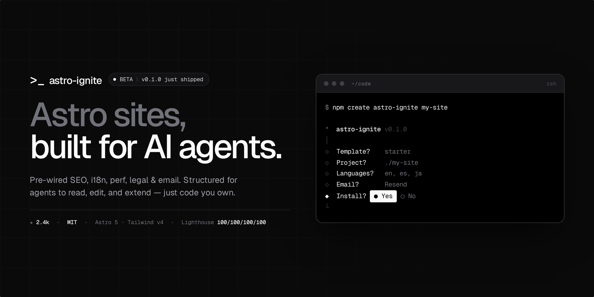

# Astro Ignite



Production-grade Astro sites that AI agents can read, edit, and extend. SEO, i18n, performance, legal, and email are pre-wired with sane defaults, every line is code you own. No runtime dependency on this tool once you've scaffolded.

```bash
npm create astro-ignite@latest my-site
# or, directly:
npx astro-ignite bootstrap my-site
```

## Quickstart

```bash
npx astro-ignite bootstrap my-site
cd my-site
pnpm dev
```

The CLI scaffolds the chosen template, installs deps with your preferred package manager, and runs `git init`. From there it's a normal Astro project you own outright — `astro-ignite` is not a runtime dependency.

## Architecture

- **Shadcn-style CLI, not a framework.** `create-astro-ignite` is a one-shot scaffolder. After install it's gone from `node_modules` — zero imports, no plugin, no auto-update, no telemetry.
- **Three concerns, three packages.** The CLI in `packages/create-astro-ignite/`, real Astro projects in `packages/templates/<kind>/` (`starter`, `docs`, …), and a shadcn-style component registry in `packages/registry/`. The CLI assembles a template; the registry's atoms ship pre-installed.
- **Apps are canonical scaffolded outputs.** `apps/site` and `apps/docs` are mirrors generated from the templates, not sources.

## Tech stack

- **Astro 5** with native i18n, content collections, and Astro Actions (`@astrojs/node@^9` adapter)
- **Tailwind v4** below the fold + scoped `<style>` above; **Beasties** extracts critical CSS at build time
- **CSS variables for design tokens**; tri-state dark mode via class flip
- **Astro + vanilla JS for every component** — no React/Vue/Svelte/Radix anywhere. Native HTML primitives first (`<details>`, `<dialog>`, popover API); custom elements when native won't do
- **`schema-dts`** typed JSON-LD composed via `@graph`
- **Astro Actions + Zod** + Resend or SMTP for the contact form
- **Plausible**, env- and consent-gated; **self-hosted Geist Sans + Mono**
- **pnpm@9.15.0** workspaces, **tsup** for the CLI, **vitest**, **changesets**, **Lighthouse CI** (mobile + desktop, hard gate)

See [`AGENTS.md`](./AGENTS.md) for the full set of rules that fall out of these choices.

## Templates

| Template            | Use case                                                                     | Live preview                                                           |
| ------------------- | ---------------------------------------------------------------------------- | ---------------------------------------------------------------------- |
| `starter` (default) | Marketing site + blog + projects, contact form, full i18n, legal pages       | [`starter.astroignite.dev`](https://starter.astroignite.dev)           |
| `docs`              | Documentation site built from primitives (no Starlight); search via Pagefind | [`docs-starter.astroignite.dev`](https://docs-starter.astroignite.dev) |

## What you get

- **Lighthouse 100s** on mobile and desktop, CI-enforced (the build fails before a regression ships)
- **Astro 5** with native i18n, content collections, and Astro Actions
- **Tailwind v4** with a layered CSS strategy — scoped styles above the fold, utilities below, critical CSS extracted at build time
- **Typed Schema.org JSON-LD** via `schema-dts`, composed per-page into one `@graph`
- **Image components** with AVIF + WebP, responsive `srcset`, and LQIP placeholders
- **System font stack via design tokens** — no font fetches on first paint, swap in Geist (or any custom face) by editing a single CSS token
- **Tri-state dark mode** (light / dark / system) with an anti-flash inline script
- **Working contact form** built on Astro Actions, Zod-validated, with Resend or SMTP
- **Cookie banner + legal pages** (privacy, terms, cookies) — i18n-aware templates you adapt
- **Plausible analytics**, env-gated and consent-gated (easy swap to Umami / Fathom / GA)
- **Sitemap, RSS, robots, manifest** — all i18n-aware
- **Blog and projects** as content collections with strict Zod schemas
- **A copy-paste component registry** — 18 atoms + 14 blocks, pre-installed in the starter template (an `astro-ignite add <name>` subcommand is on the roadmap)

## Development

```bash
pnpm install
pnpm dev                   # alias for dev:site
pnpm dev:site              # apps/site
pnpm dev:docs              # apps/docs
pnpm dev:starter           # iterate on the starter template directly
pnpm dev:docs-template     # iterate on the docs template directly
pnpm dev:cli               # iterate on the CLI

pnpm build                 # build every package
pnpm test                  # run all tests
pnpm typecheck             # recursive astro check / tsc --noEmit
pnpm format                # prettier --write across the monorepo
pnpm scaffold:test         # full scaffold → install → build → Lighthouse loop
```

See [`CONTRIBUTING.md`](./CONTRIBUTING.md) for more.

## License

MIT.
