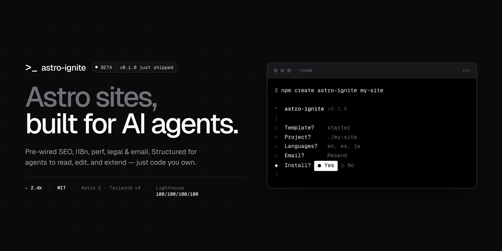

# astro-ignite



> Astro sites, built for AI agents.

```bash
npm create astro-ignite@latest my-site
```

Production-grade Astro sites that AI agents can read, edit, and extend. SEO, i18n, performance, legal, and email — pre-wired with sane defaults, every line is code you own. No runtime dependency on this tool once you've scaffolded.

## What you get

- **Lighthouse 100s** on mobile and desktop, CI-enforced (the build fails before a regression ships)
- **Astro 5** with native i18n, content collections, and Astro Actions
- **Tailwind v4** with a layered CSS strategy — scoped styles above the fold, utilities below, critical CSS extracted at build time
- **Typed Schema.org JSON-LD** via `schema-dts`, composed per-page into one `@graph`
- **Image components** with AVIF + WebP, responsive `srcset`, and LQIP placeholders
- **Geist Sans + Geist Mono** through `astro:fonts` — self-hosted, zero CLS
- **Tri-state dark mode** (light / dark / system) with an anti-flash inline script
- **Working contact form** built on Astro Actions, Zod-validated, with Resend or SMTP
- **Cookie banner + legal pages** (privacy, terms, cookies) — i18n-aware templates you adapt
- **Plausible analytics**, env-gated and consent-gated (easy swap to Umami / Fathom / GA)
- **Sitemap, RSS, robots, manifest** — all i18n-aware
- **Blog and projects** as content collections with strict Zod schemas
- **A copy-paste component registry** — 18 atoms + 14 blocks, installed with `npx astro-ignite add <name>`

## Development

```bash
pnpm install
pnpm dev                   # alias for dev:site
pnpm dev:site              # apps/site
pnpm dev:docs              # apps/docs
pnpm dev:starter           # iterate on the starter template directly
pnpm dev:docs-template     # iterate on the docs template directly
pnpm dev:cli               # iterate on the CLI

pnpm build                 # build every package
pnpm test                  # run all tests
pnpm typecheck             # recursive astro check / tsc --noEmit
pnpm format                # prettier --write across the monorepo
pnpm scaffold:test         # full scaffold → install → build → Lighthouse loop
```

See [`CONTRIBUTING.md`](./CONTRIBUTING.md) for more.

## License

MIT.
